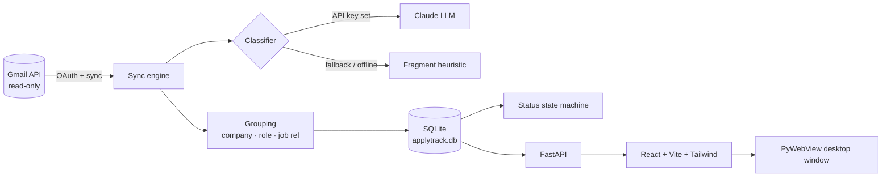

# ApplyTrack

> **EN:** Track your job applications automatically from a dedicated Gmail account —
> bilingual (DE/EN) email classification, live status, and a clean dashboard.
>
> **DE:** Verfolge deine Bewerbungen automatisch über ein dediziertes Gmail-Konto —
> zweisprachige E-Mail-Klassifizierung (DE/EN), Live-Status und ein übersichtliches
> Dashboard.

**EN**
ApplyTrack connects to a dedicated Gmail account used for job hunting and turns a messy
inbox into a clear overview of every application. It reads your mail (read-only),
automatically detects which company and role each thread belongs to, and classifies every
message — application sent, acknowledged, interview invitation, next round, rejection, or
offer — in both German and English. A clean dashboard shows the live status of each
application, flags the ones that have gone quiet, and lets you correct the rare
misclassification. Built with FastAPI, a React + TypeScript frontend, and an LLM-based
bilingual classifier with a no-API-key fallback.

**DE**
ApplyTrack verbindet sich mit einem dedizierten Gmail-Konto für die Stellensuche und
verwandelt ein unübersichtliches Postfach in eine klare Übersicht aller Bewerbungen. Die
App liest deine E-Mails (nur lesend), erkennt automatisch Unternehmen und Position je
Konversation und klassifiziert jede Nachricht — Bewerbung versendet, Eingangsbestätigung,
Einladung zum Gespräch, nächste Runde, Absage oder Angebot — auf Deutsch und Englisch. Ein
übersichtliches Dashboard zeigt den aktuellen Status jeder Bewerbung, markiert Bewerbungen
ohne Rückmeldung und lässt dich seltene Fehlklassifizierungen korrigieren. Umgesetzt mit
FastAPI, einem React-Frontend mit TypeScript und einem zweisprachigen LLM-Klassifikator
mit Fallback ohne API-Key.

---

## Screenshots

| Dashboard (light) | Dashboard (dark) | Application timeline |
| --- | --- | --- |
| _screenshot placeholder_ | _screenshot placeholder_ | _screenshot placeholder_ |

## Features

- **Read-only Gmail sync** — full first sync, then incremental via Gmail's `historyId`.
- **Bilingual classification (DE/EN)** of every email into `application_sent`,
  `application_received`, `interview_invite`, `next_round`, `rejection`, `offer`,
  `info_request` or `not_application_related`.
  - Offline **fragment heuristic** (umlaut-tolerant substrings, email-level precedence —
    a polite "thank you" never hides a rejection).
  - Optional **Claude LLM classifier** (Haiku by default) with strict JSON validation
    and automatic fallback to the heuristic.
- **One application per job** — confirmation and rejection arriving in separate threads
  are merged via the job reference number (e.g. `335649BR`) or company + role; different
  jobs at the same company stay separate.
- **Company & role extraction** from headers, ATS platforms (Workday, Brassring,
  Umantis, Oracle …), subjects and mail text.
- **Status state machine** — `offer > rejection > next_round > interview_invite >
  info_request > application_received > application_sent`, plus a **ghosted** flag after
  21 days without reply (configurable).
- **Dashboard** — stat cards, status distribution, sortable/filterable table, email
  timeline with confidence, "Needs review" queue with manual overrides (always win),
  filtered-mail view (nothing is silently dropped).
- **DE/EN UI toggle**, light/dark mode, desktop window via PyWebView.
- **Stay signed in** — tokens refresh automatically; an expired session shows a
  one-click reconnect.
- **Ignore list** for recruiting agencies or other senders (`IGNORED_SENDERS`).

## Architecture



| Layer | Tech |
| --- | --- |
| Backend | Python 3.11+, FastAPI, SQLAlchemy 2 (SQLite; Postgres via `DATABASE_URL`) |
| Gmail | `google-api-python-client`, `google-auth-oauthlib` (`gmail.readonly`) |
| Classification | Fragment heuristic + optional Anthropic Claude |
| Frontend | React 18, TypeScript, Vite, Tailwind, Framer Motion, Recharts, lucide-react |
| Desktop | PyWebView (FastAPI serves the built frontend) |

## Setup

### 1. Google Cloud (one-time)

1. Create a project at <https://console.cloud.google.com/>.
2. **Enable the Gmail API** (APIs & Services → Library → Gmail API → Enable).
3. **Google Auth Platform → Branding**: app name, support email, developer contact,
   home page and privacy-policy link (e.g. this repository and [`PRIVACY.md`](PRIVACY.md)).
4. **Google Auth Platform → Audience**: user type *External*; add your Gmail address
   under **Test users**.
5. **Google Auth Platform → Clients → Create client → Desktop app**, download the JSON
   and save it as `backend/credentials.json`.

> **Testing vs. production.** While the app is in *Testing*, only listed test users can
> connect, and Google expires refresh tokens after **7 days** — you'd have to reconnect
> weekly. For personal use, click **Publish app** on the Audience page: you'll see an
> "unverified app" notice once when connecting, then stay signed in. Connecting
> arbitrary external accounts to a *hosted* version would require Google's verification
> and security review for the restricted Gmail scope.
>
> The address you type in ApplyTrack only declares *intent*: access is granted solely by
> the account owner on Google's consent screen, and ApplyTrack verifies that the
> authorised account matches the address you entered.

### 2. Install

Requirements: Python 3.11+, Node.js 18+.

```bash
cd backend
python -m venv .venv
.venv/Scripts/activate        # Windows  (macOS/Linux: source .venv/bin/activate)
pip install -e ".[dev,desktop]"
cp ../.env.example .env       # optional: add ANTHROPIC_API_KEY, IGNORED_SENDERS, …
```

```bash
cd frontend
npm install
npm run build                 # the desktop app serves frontend/dist
```

### 3. Connect, sync, run

```bash
cd backend
applytrack connect you@gmail.com   # opens Google's consent screen
applytrack sync                    # first full sync, then incremental
applytrack app                     # native desktop window
```

No Gmail at hand? `applytrack seed` loads an anonymised DE/EN sample dataset.

### Docker (alternative)

```bash
docker compose up --build      # UI on http://localhost:8080, API behind nginx at /api
```

The container mounts `credentials.json` and `token.json` from the repository root
(read-only) — run `applytrack connect` once on the host and copy both files there.
The database lives on the `applytrack-data` volume.

### CLI

| Command | Purpose |
| --- | --- |
| `applytrack connect [EMAIL]` | OAuth + account verification (defaults to the last account) |
| `applytrack disconnect` | Delete the stored token |
| `applytrack sync [--full]` | Pull and classify new mail |
| `applytrack reclassify` | Re-run classification + grouping on stored mail (keeps overrides) |
| `applytrack app` | Desktop window |
| `applytrack serve` | API server only (`--reload` for dev) |
| `applytrack status` | Table of applications in the terminal |
| `applytrack seed` | Load the sample dataset |

## Configuration

See [`.env.example`](.env.example).

| Variable | Default | Description |
| --- | --- | --- |
| `ANTHROPIC_API_KEY` | – | Enables the LLM classifier (otherwise offline heuristic) |
| `APPLYTRACK_MODEL` | `claude-haiku-4-5` | Claude model for classification |
| `DATABASE_URL` | `sqlite:///./applytrack.db` | Any SQLAlchemy URL (e.g. Postgres) |
| `GOOGLE_CREDENTIALS_FILE` | `credentials.json` | OAuth client file |
| `GOOGLE_TOKEN_FILE` | `token.json` | Cached OAuth token |
| `GHOST_THRESHOLD_DAYS` | `21` | Days without reply before "ghosted" |
| `REVIEW_CONFIDENCE_THRESHOLD` | `0.6` | Below this, emails land in "Needs review" |
| `IGNORED_SENDERS` | – | Comma-separated senders/domains to treat as noise |

## Development

```bash
cd backend && pytest && ruff check applytrack tests
cd frontend && npm run lint && npm run build
```

Frontend dev server with hot reload: `npm run dev` (proxies `/api` to `applytrack serve`
on port 8000).

GitHub Actions ([`.github/workflows/ci.yml`](.github/workflows/ci.yml)) runs ruff + pytest
for the backend and lint, typecheck and build for the frontend on every push and PR.
Contributions: see [`CONTRIBUTING.md`](CONTRIBUTING.md).

## Privacy & security

- Gmail scope is **read-only**; ApplyTrack never sends, changes or deletes mail.
- Everything stays on your machine. `credentials.json`, `token.json`, `.env` and the
  database are git-ignored. Full email bodies are never stored or logged (only a
  500-character excerpt).
- See [`PRIVACY.md`](PRIVACY.md).

## License

[MIT](LICENSE)
